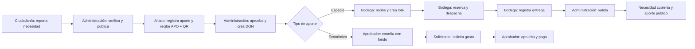

# Manual operativo exacto · Ruta Solidaria

**Entorno:** sandbox sintético · **Versión:** 0.3 · **Fecha:** 2026-08-16

**Aplicación publicada:** `https://unidos-nos-cuidamos.vercel.app`

> Este manual sirve para ensayar correctamente el flujo actual. No autoriza personas, direcciones, teléfonos, correos, dinero, marcas ni operaciones reales. `G-022` está cerrado solo en local; mientras `G-021` y el despliegue remoto de `G-022` sigan pendientes, usa exclusivamente datos ficticios.

## 1. Resultado que debes obtener

El ensayo correcto termina con estos estados:

| Registro | Código | Estado final esperado |
|---|---|---|
| Necesidad | `NEC-*` | `Cubierto` |
| Intake en especie | `APO-*` | `Aprobado` |
| Donación en especie | `DON-*` | `Validada` |
| Despacho | `DSP-*` | `Validada` |
| Intake económico | `APO-*` | `Aprobado` |
| Donación económica | `DON-*` | `Validada` / conciliada |
| Solicitud de gasto | sin código público | `Pagada` |

El QR actual contiene el código `APO-*`. Conserva además el código `DON-*`, porque el QR todavía no refleja el estado operacional final (`G-023`).

## 2. Preparación obligatoria

### 2.1 Credenciales

Usa las cinco cuentas del archivo seguro:

`%LOCALAPPDATA%\RutaSolidaria\accesos-sandbox-iniciales.txt`

Busca cada cuenta por el campo `Rol`. No copies contraseñas al chat, al repositorio, a capturas ni a documentos.

| Clave de rol | Para qué se usa |
|---|---|
| `admin` | Verificar necesidades, aprobar aportes y validar entregas |
| `partner` | Registrar aportes en especie y económicos |
| `warehouse` | Recibir, reservar, despachar y registrar entrega |
| `requester` | Crear la solicitud de gasto |
| `approver` | Conciliar, aprobar y pagar en el libro sandbox |

Usa cinco perfiles del navegador o cierra sesión antes de cambiar de rol. No realices todo con `admin`: el ensayo debe demostrar separación de funciones.

### 2.2 Identificador y datos del ejercicio

Antes de empezar crea un identificador único, por ejemplo:

`PRUEBA-20260816-1530`

Usa el mismo identificador en descripciones, referencias y finalidades. Datos recomendados:

| Campo | Valor sintético |
|---|---|
| Categoría | `Agua` / `Agua potable` |
| Cantidad | `10` |
| Unidad | `litro` |
| Zona pública | `Zona sintética PRUEBA-...` |
| Descripción de necesidad | `Punto comunitario ficticio requiere agua sellada para el ejercicio PRUEBA-...` |
| Artículo | `Botellas selladas PRUEBA-...` |
| Donante | `Donante sintético PRUEBA-...` |
| Correo ficticio | `prueba-...@example.invalid` |
| Aporte económico | `500000` COP |
| Gasto | `125000` COP |
| Soporte | `SOPORTE-SINTETICO-PRUEBA-...` |

### 2.3 Hoja de control

Prepara esta tabla y complétala durante el recorrido:

| Dato | Valor |
|---|---|
| Identificador de ejercicio | |
| Código necesidad `NEC-*` | |
| Código intake especie `APO-*` | |
| Código donación especie `DON-*` | |
| Código lote `LOT-*` | |
| Código despacho `DSP-*` | |
| Código intake económico `APO-*` | |
| Código donación económica `DON-*` | |
| Finalidad exacta del gasto | |
| Resultado final | |

### 2.4 Comprobación técnica previa

1. Abre `https://unidos-nos-cuidamos.vercel.app/api/health`.
2. Continúa solo si responde `status: ok` y `checks.database: connected`.
3. Abre `/reportar` y confirma que no aparezca “El evento no está disponible”.
4. Confirma que el aviso indica que es una instancia de práctica.

### 2.5 Parametrizar un punto de entrega (solo administración)

Esta pantalla está disponible en local después de aplicar `202608160003_parameterized_delivery_points.sql`. No la pruebes aún sobre la URL publicada: el remoto conserva una versión anterior hasta que se autoricen y apliquen las migraciones pendientes.

1. Inicia sesión con `admin` y abre `/operaciones/centros`.
2. Pulsa **Nuevo punto**.
3. En **Organización responsable**, elige la organización cuyos aliados podrán usar el punto. Esta relación determina el aislamiento de permisos.
4. Escribe un **Nombre operativo** reconocible.
5. En **Zona pública aproximada**, escribe ciudad y sector amplio; nunca una dirección exacta.
6. En **Dirección exacta privada**, registra únicamente un valor sintético durante el sandbox. Este campo no aparece en el mapa ni en las tarjetas públicas.
7. En **Instrucciones públicas**, explica cómo coordinar después de recibir el código `APO-*`; no incluyas teléfonos personales, nombres ni direcciones.
8. Registra latitud y longitud aproximadas dentro de Colombia. La precisión debe representar una zona segura, no una puerta o vivienda.
9. Marca todas las **Categorías que recibe**. Debe existir al menos una.
10. Marca **Cuenta con cadena de frío** solo si la capacidad fue comprobada. Conserva **Punto activo** para habilitarlo.
11. Pulsa **Crear punto de entrega** una sola vez.
12. Comprueba que la tarjeta muestre organización, zona, categorías, capacidad e instrucción, pero no la dirección privada.
13. Inicia sesión como aliado de esa organización y abre `/donar`: el paso **Punto de entrega** debe mostrar únicamente sus puntos activos y compatibles.

Para corregir un punto, usa **Editar**. Para retirarlo de nuevas solicitudes, desmarca **Punto activo** y guarda. No se elimina: la desactivación y cada cambio de reglas conservan auditoría append-only.

## 3. Flujo A · Necesidad y aporte en especie

### Paso A1. Crear la necesidad como ciudadanía

1. Sin iniciar sesión, entra a `/reportar`.
2. En **¿Qué tipo de ayuda hace falta?**, selecciona **Agua**.
3. En **Zona aproximada**, escribe `Zona sintética PRUEBA-...`.
4. En **Hechos observados**, escribe la descripción ficticia preparada. Debe tener al menos 20 caracteres.
5. En **Cantidad aproximada**, escribe `10`.
6. En **Unidad**, selecciona `litro`.
7. Deja vacíos **Ubicación exacta** y **Correo de contacto** mientras `G-021` siga abierto.
8. Marca la confirmación de buena fe.
9. Pulsa **Enviar a verificación** una sola vez.
10. Copia el código `NEC-*` en la hoja de control.

**Debe ocurrir:** aparece “Reporte recibido, aún no publicado” y el estado interno inicial es `Reportado`.

**Detente si:** el sistema informa que el evento no está disponible, alcanzaste la cuota de cinco reportes en diez minutos o no genera el código.

### Paso A2. Verificar y publicar la necesidad

1. En otro perfil, entra a `/ingresar?next=/operaciones` con la cuenta `admin`.
2. En **Cola de verificación**, busca la fila **Agua · Zona sintética PRUEBA-...**.
3. Comprueba categoría, zona, descripción, cantidad y vigencia.
4. Si los datos son correctos, pulsa **Verificar**.
5. Espera la actualización de la página. La fila debe mostrar estado `Verificado` y el botón **Publicar seguro**.
6. Pulsa **Publicar seguro**.
7. Abre `/seguimiento`, escribe el `NEC-*` y pulsa **Ver mi recorrido**.

**Debe ocurrir:** seguimiento muestra `Publicado` y la necesidad aparece en la lista pública/transparencia con zona amplia, nunca dirección exacta.

**Si hay un error:** usa **Observar** o **Rechazar**. No apruebes para “hacer avanzar” la prueba. Las correcciones agregan historia; no borres registros.

### Paso A3. Registrar el aporte en especie como aliado

1. Cierra sesión de `admin` o usa el perfil `partner`.
2. Entra a `/ingresar?next=/donar` con la cuenta `partner`.
3. Paso 1 de 4, **Tu aporte**:
   - deja seleccionado **Bienes en especie**;
   - elige **Agua potable**; el editor del artículo aparece al elegir la categoría;
   - **¿Qué es?**: `Botellas selladas PRUEBA-...`;
   - **Cantidad**: `10`;
   - **Unidad**: `litro`;
   - no abras **Estado, cuidado y valor estimado**: por defecto queda `Sellado` y `Ambiente`, y el valor estimado vacío;
   - conserva la situación declarada `Comprometida`;
   - pulsa **Continuar**.
4. Paso 2 de 4, **Punto de entrega**:
   - selecciona uno de los puntos activos y compatibles mostrados para tu organización;
   - confirma la zona aproximada, las categorías aceptadas y la instrucción pública;
   - si no aparece ningún punto, detén el flujo y pide a administración que lo parametrice; no intentes usar un identificador de otra organización;
   - deja cerrado **Destino previsto y alcance**, es decir sin destinación específica;
   - pulsa **Continuar**.
5. Paso 3 de 4, **Contacto**:
   - nombre: `Donante sintético PRUEBA-...`;
   - correo: el correo `example.invalid` preparado;
   - en **Evidencia fotográfica**, adjunta de cero a tres imágenes sintéticas JPG/PNG de máximo 5 MB cada una. No uses rostros, documentos ni datos reales;
   - atribución pública: `De forma anónima`;
   - abre **Más datos internos** y selecciona tipo de donante `Empresa` y aliado relacionado `PROPACIFICO` para este ejercicio. El aliado es una referencia del resumen, no cambia la organización de tu sesión;
   - deja teléfono, responsable y contacto interno vacíos;
   - si eliges **Otro (especificar en Observaciones)**, escribe el nombre sintético del aliado en **Observaciones internas**;
   - pulsa **Continuar**.
6. Paso 4 de 4, **Revisar y enviar**:
   - verifica 10 litros, centro correcto, `PROPACIFICO` como referencia, cantidad de fotos y atribución anónima;
   - marca la declaración;
   - pulsa **Confirmar aporte** una sola vez.
7. Guarda el código `APO-*` y el QR.

**Debe ocurrir:** aparece “Tu aporte quedó reportado con un código”. Si adjuntaste fotos, el comprobante confirma que quedaron privadas y pendientes de revisión. Todavía no existe inventario, recepción ni impacto.

**Si una foto no termina de cargar:** no repitas el aporte. Conserva el `APO-*` y entrega ese código a administración; el intake ya existe y el sistema mantiene el intento de evidencia para revisión.

### Paso A4. Aprobar el intake

1. Vuelve al perfil `admin` y abre `/operaciones`.
2. En la cola busca **Especie · APO-...** usando el código exacto.
3. Comprueba que tiene una línea, atribución anónima y estado pendiente.
4. Pulsa **Aprobar**.

**Debe ocurrir:** el intake desaparece de pendientes y se crea una promesa operacional `DON-*`. Aprobar no equivale a recibir.

### Paso A5. Recibir físicamente y crear el lote

1. Entra con `warehouse` a `/operaciones/bodega`.
2. En **Recepciones pendientes**, busca `Agua`.
3. Identifica `Botellas selladas PRUEBA-...` y copia su código `DON-*`.
4. En **Aceptada**, escribe `10`.
5. En **Rechazada**, escribe `0`.
6. Confirma como **Centro receptor** `Centro de acopio Centro · Sandbox`.
7. Pulsa **Confirmar recepción** una sola vez.

**Debe ocurrir:** aparece “Recepción conciliada y lote creado exactamente una vez” y se crea un `LOT-*`.

**Regla:** aceptada + rechazada no puede superar la cantidad pendiente. Si estás sin conexión, deja que la operación permanezca en la cola local y usa **Sincronizar ahora** al recuperar conexión; no la captures otra vez con otros valores.

### Paso A6. Reservar el inventario para la necesidad

1. En **Reservar existencia**, selecciona el lote `LOT-*` recién creado.
2. En **Necesidad compatible**, selecciona `Zona sintética PRUEBA-... · faltan 10 litro`.
3. En **Cantidad a reservar**, escribe `10`.
4. Pulsa **Reservar con control de concurrencia**.

**Debe ocurrir:** aparece “Existencia reservada” y una asignación queda en estado `Reservada`.

**Detente si:** no aparece la necesidad. Categoría y unidad deben coincidir exactamente (`Agua` + `litro`); no elijas otro caso solo para continuar.

### Paso A7. Crear el despacho y registrar la entrega

1. En **Asignaciones listas**, localiza el `LOT-*` y pulsa **Crear despacho**.
2. Copia el nuevo código `DSP-*`.
3. En **Despachos**, busca ese `DSP-*` y pulsa **Registrar entrega**.

**Debe ocurrir:** el despacho pasa de `Despachada` a `Entregada`, pero todavía espera validación independiente.

### Paso A8. Validar independientemente la entrega

1. Cierra la sesión `warehouse`.
2. Entra con `admin` a `/operaciones/bodega`.
3. Baja a **Entregas** y busca el `DSP-*`.
4. Comprueba `10 entregadas · 0 dañadas`.
5. Pulsa **Validar y conciliar**.

**Debe ocurrir:**

- entrega y despacho quedan `Validados`;
- donación `DON-*` queda `Validada`;
- necesidad `NEC-*` queda `Cubierta` 10/10;
- el aporte aparece en `/transparencia`.

No valides con el mismo actor que registró la entrega.

## 4. Flujo B · Aporte económico y gasto segregado

### Paso B1. Registrar el aporte económico

1. Entra a `/donar` con `partner`.
2. Paso 1 de 3, **Tu aporte**: el recorrido económico omite el punto de entrega porque no hay bien físico que recibir.
   - selecciona **Aporte económico**;
   - escribe `500000` COP;
   - conserva la situación declarada `Comprometida`;
   - deja cerrado **Destino previsto y alcance**;
   - pulsa **Continuar**.
3. Paso 2 de 3, **Contacto**:
   - nombre `Donante monetario sintético PRUEBA-...`;
   - correo `example.invalid`;
   - atribución anónima;
   - en **Más datos internos**, elige aliado relacionado solo si corresponde como referencia interna; no lo uses para suplantar identidad;
   - sin teléfono, cuentas, tarjetas, claves ni referencias bancarias;
   - pulsa **Continuar**.
4. Paso 3 de 3: revisa, marca la declaración y pulsa **Confirmar aporte**.
5. Guarda el `APO-*` económico.

**Debe ocurrir:** solo queda una declaración pendiente. La plataforma no procesa ni recauda el dinero.

### Paso B2. Aprobar el aporte económico

1. Entra con `admin` a `/operaciones`.
2. Busca **Económico · APO-...**.
3. Pulsa **Aprobar**.

**Debe ocurrir:** se crea la promesa económica `DON-*`, todavía sin afectar saldo ni transparencia.

### Paso B3. Conciliar con el fondo

1. Entra con `approver` a `/operaciones/tesoreria`.
2. En **Aportes económicos pendientes**, busca el `APO-*`.
3. Copia el código `DON-*` mostrado como promesa operacional.
4. Selecciona **Fondo de respuesta · Sandbox**.
5. En **Referencia del soporte**, escribe `SOPORTE-SINTETICO-PRUEBA-...`.
6. Pulsa **Conciliar aporte** una sola vez.

**Debe ocurrir:** aparece “Aporte conciliado y publicado”; el libro muestra un ingreso de COP 500.000 y la donación aparece en transparencia.

No uses **Conciliar otro ingreso** para este aporte: esa opción es solo para ingresos que no nacen de un intake.

### Paso B4. Crear la solicitud con un actor distinto

1. Cierra `approver` y entra con `requester` a `/operaciones/tesoreria`.
2. En **Solicitar gasto**:
   - fondo: `Fondo de respuesta · Sandbox`;
   - monto: `125000`;
   - finalidad: `Compra sintética de insumos PRUEBA-...`;
   - pulsa **Enviar a aprobación**.

**Debe ocurrir:** aparece “Solicitud creada. Debe aprobarla una persona diferente” y el estado es `Solicitada`.

### Paso B5. Aprobar y pagar

1. Cierra `requester` y vuelve a entrar con `approver`.
2. En **Solicitudes de gasto**, busca la finalidad exacta `PRUEBA-...`.
3. Comprueba monto `125000` y estado `Solicitada`.
4. Pulsa **Aprobar**.
5. Espera la actualización; la misma solicitud debe quedar `Aprobada` y mostrar **Pagar**.
6. Pulsa **Pagar** una sola vez.

**Debe ocurrir:** estado `Pagada`; el libro agrega un egreso de COP 125.000 y el saldo disminuye. El solicitante nunca aprueba ni paga su propia solicitud.

## 5. Comprobación final

### 5.1 Seguimiento

1. Abre `/seguimiento` sin sesión.
2. Consulta el `NEC-*`: debe mostrar `Cubierto`.
3. Consulta el `DON-*` en especie: debe mostrar `Validada`.
4. Consulta el `DON-*` económico: debe mostrar `Validada`.
5. Consulta el `APO-*` del QR: actualmente mostrará `Aprobado`. Regístralo como limitación `G-023`, no como entrega fallida.

### 5.2 Transparencia

1. Abre `/transparencia`.
2. Busca el código público de la donación en especie y los 10 litros verificados.
3. Busca el `DON-*` económico y COP 500.000 conciliados.
4. Confirma que no aparezcan nombre privado ni correo ficticio.
5. Descarga el Excel público y comprueba que abre.

Las filas deben reflejar el ejercicio. Las tarjetas superiores pueden conservar un corte anterior hasta cerrar `G-027`.

### 5.3 Mapa

1. Abre `/` y la sección **Mapa**.
2. Confirma los dos centros aproximados.
3. No uses la ausencia de la línea del despacho como prueba de entrega: el reporte ciudadano actual no produce coordenadas aproximadas y mantiene abierto `G-024`.

### 5.4 Cierre de la ejecución

1. Completa la hoja de control.
2. Marca el resultado `Aprobado con limitaciones conocidas` si todos los estados esperados coinciden.
3. Cierra todas las sesiones.
4. No borres registros. Si hubo una equivocación, usa `Observar` o `Rechazar` y registra una corrección compensatoria.
5. No presentes cifras del sandbox como impacto real.

## 6. Cuándo detener el flujo

Detén el ejercicio y avisa al administrador si ocurre cualquiera de estos casos:

- alguien propone introducir una persona, dirección, contacto, soporte, marca o dinero real;
- `/api/health` no confirma la base conectada;
- aparece un punto perteneciente a otra organización o no hay ningún punto compatible para la cuenta `partner`;
- categoría o unidad del lote no coincide con la necesidad;
- aceptada + rechazada supera lo prometido;
- un solo actor intenta solicitar y aprobar el mismo gasto;
- el saldo conciliado es menor que el gasto;
- un código no se genera o cambia de entidad sin quedar anotado;
- la interfaz muestra un error de permisos: no cambies de cuenta para eludirlo.

## 7. Problemas frecuentes

| Síntoma | Qué hacer |
|---|---|
| “El evento no está disponible” | Revisa `/api/health` y el evento remoto; no sigas. |
| “No puedes verificar/aprobar” | Confirma que usas `admin`, no `partner` o `warehouse`. |
| No aparece la recepción | Confirma que el intake fue aprobado y busca por `Agua`; copia el `DON-*`. |
| No aparece necesidad compatible | Revisa que ambos sean `Agua` y `litro`. |
| No hay botón **Validar y conciliar** | Cierra `warehouse` e ingresa con `admin`. |
| No aparece el aporte en tesorería | Primero apruébalo con `admin`; después entra con `approver`. |
| No aparece **Pagar** | La solicitud debe estar aprobada por `approver` y tener saldo suficiente. |
| El QR queda en `Aprobado` | Consulta el `DON-*` para el estado final y registra `G-023`. |
| Despacho ausente del mapa | Verifica por `DSP-*`, seguimiento y transparencia; registra `G-024`. |
| Operación offline pendiente | Reconecta y pulsa **Sincronizar ahora**; no recaptures con otra clave. |

## 8. Referencias

- Resultado de la simulación: `docs/REMOTE_FLOW_SIMULATION_2026-08-16.md`
- Estado y bloqueos: `docs/STATUS.md`
- Brechas: `docs/GAP_LEDGER.md`
- Modelo operativo: `docs/OPERATING_MODEL.md`
- Descripción técnica: `docs/DESCRIPCION_TECNICA.md`
