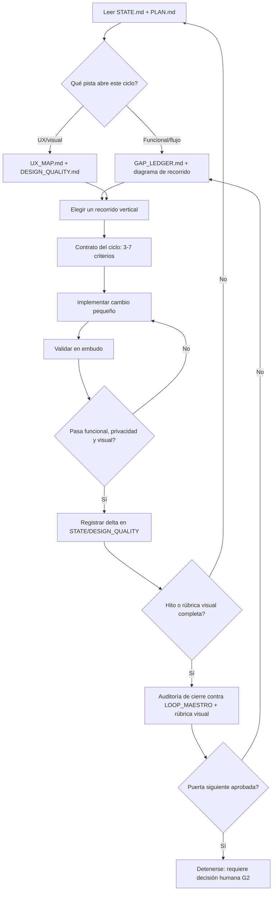
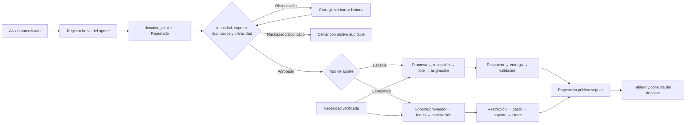

# Sistema operativo compacto para Claude Opus 5 · flujo, UX y elevación visual

> **Proyecto:** Ruta Solidaria — plataforma de trazabilidad de donaciones en Colombia
> **Versión:** 1.0 · 17 de agosto de 2026
> **Modelo:** Claude Opus 5 (alias más reciente disponible en tu entorno: Claude Code, API o Cowork). No se delega a un modelo menor: todo el loop corre en Opus 5, incluidos los subagentes.
> **Objetivo:** validar, corregir y optimizar el flujo de vida del proceso de donación, elevar la experiencia de usuario y llevar el nivel gráfico a estándar de producto — sin repetir contexto, sin perder calidad y sin exceder el hito ya aprobado (G1 local).

## Qué es este documento y qué no reemplaza

- No sustituye `docs/LOOP_MAESTRO_DESARROLLO_PLATAFORMA_DONACIONES_EMERGENCIA.md` (la constitución) ni `docs/SISTEMA_OPERATIVO_CODEX_GPT_5_6_SOL_DONACIONES.md` (el sistema operativo ya instalado para Codex/GPT-5.6 Sol). Los tres pueden coexistir: cualquier agente que tome una sesión lee la misma memoria en `docs/ai/`.
- Este documento añade dos cosas que el sistema de Codex no cubría explícitamente: (1) una **pista de flujo de vida** que audita el recorrido operacional completo en vez de solo el siguiente hito funcional, y (2) una **pista visual/UX** con rúbrica propia, porque hoy esa dimensión solo aparece como columna de texto libre en `docs/UX_MAP.md`.
- Calibrado para Opus 5 porque es el modelo con el que vas a ejecutar el loop: usa su ventana de razonamiento extendido para las decisiones de alto impacto y su capacidad de trabajar con subagentes de solo lectura para no inflar el hilo principal.

## Decisión principal

Misma arquitectura de dos capas que ya usa el proyecto, con una tercera pista añadida:

1. **Constitución estable** — `LOOP_MAESTRO...md`. Se relee completo solo al instalar, cambiar de hito o resolver una contradicción.
2. **Loop operativo compacto** — memoria en `docs/ai/` + micro-loop `CERRAR`, igual que en el sistema de Codex.
3. **Pista de flujo + UX + visual (nueva)** — usa el diagrama de recorrido de producto y `docs/UX_MAP.md` como fuente de verdad para elegir qué validar, corregir u optimizar cuando la unidad de valor no es una brecha funcional del `GAP_LEDGER` sino una fricción de experiencia o un déficit visual.



## Las dos pistas de un mismo loop

No son loops paralelos: comparten memoria, comparten `STATE.md` y solo una está activa por ciclo. La regla de prioridad de "Elegir" (abajo) decide cuál abrir.

| Pista | Fuente de verdad | Qué valida | Qué corrige |
|---|---|---|---|
| Flujo de vida del proceso | Diagrama de recorrido (más abajo) + `GAP_LEDGER.md` + `docs/ai/STATE.md` | Que cada tránsito de estado (reportado → verificado → aprobado → recibido → reservado → despachado → entregado → validado → conciliado) sea correcto, idempotente, auditable y sin atajos que publiquen datos no verificados | Brechas P0-P2 abiertas, transiciones rotas, campos que se saltan verificación |
| UX y elevación visual | `docs/UX_MAP.md` + `docs/ai/DESIGN_QUALITY.md` (nuevo, ver abajo) | Que cada superficie cumpla la promesa de experiencia y el sistema visual ya definido (color por estado, una acción principal, Lucide, movimiento con `prefers-reduced-motion`) | Superficies marcadas 🔴 o con "validar antes de G2", inconsistencia visual, estados vacíos/carga/error ausentes, accesibilidad y responsive incompletos |

### Diagrama del recorrido de producto (flujo de vida vigente)



Este diagrama no cambió respecto al de `SISTEMA_OPERATIVO_CODEX...md`: sigue siendo el contrato del producto. La pista de flujo de vida recorre este diagrama nodo por nodo cada vez que se retoma el proyecto y contrasta cada tránsito contra `GAP_LEDGER.md` — hoy quedan abiertos `G-007`, `G-008`, `G-015`, `G-017`, `G-026` y `G-027`, todos P2 y todos afectan algún nodo de este mapa (correlación de auditoría en `L`, cortes conciliados en `M`, borde/WAF antes de `C`).

## `docs/ai/DESIGN_QUALITY.md` — la pieza de memoria que falta

Crear un archivo nuevo (no ampliar `QUALITY.md`, que ya está lleno de trazabilidad funcional/seguridad). Formato:

```markdown
# Calidad visual y de experiencia

Escala: 0 sin diseño · 1 wireframe funcional · 2 visual básico coherente ·
3 pulido con estados completos · 4 nivel producto (microinteracción, motion, AA+, mobile impecable)

| Superficie | Nivel | Brecha principal | Prueba de cierre |
|---|---:|---|---|
| Evidencias (bucket privado sin UI) | 0 | Rediseño completo pendiente, sin componente de captura por etapa | audit:a11y + audit:visual + revisión de permisos por rol |
| Home pública | 3 | Validar con usuarios reales antes de G2 | Prueba de comprensión con 5 personas fuera del equipo |
| Registro de aporte (4-5 pasos) | 3 | Validar comprensión con aliados | Métrica de abandono por paso |
| Centro de mando / operación | 2 | Validar con operadores antes de G2 | Recorrido cronometrado con rol real |
| Transparencia/impacto | 3 | Falta serie temporal cuando existan cortes | Verificación visual con datos de ≥2 cortes |
```

Sembrar las filas restantes desde la tabla "Mapa de pantallas y auditoría" de `docs/UX_MAP.md`: toda fila marcada ✅ Implementado parte en nivel 2-3 según si ya tiene estados vacíos/error probados; la única marcada 🔴 (Evidencias) parte en 0 y es la prioridad número uno de la pista visual. Actualizar solo la fila que cambió en cada ciclo — igual que `STATE.md`, no reescribir la tabla completa.

## El micro-loop `CERRAR` (sin cambios de fondo, con una regla nueva en cada letra)

### C — Cargar el mínimo

Leer `AGENTS.md`, `docs/ai/STATE.md`, la sección activa de `PLAN.md` y, según la pista elegida, `GAP_LEDGER.md` o `UX_MAP.md` + `DESIGN_QUALITY.md`. Buscar con `rg`/Grep antes de abrir archivos completos. No releer el loop maestro salvo cambio de hito o contradicción.

### E — Elegir una sola unidad de valor

Orden de prioridad (una sola pista por ciclo):

1. P0/P1 de `GAP_LEDGER.md` y riesgo de daño, privacidad, dinero o identidad.
2. Bloqueo del siguiente hito (G2).
3. Superficie en nivel 0-1 de `DESIGN_QUALITY.md` (hoy: Evidencias).
4. Transición del diagrama de recorrido sin prueba E2E que la cubra.
5. Pulido visual de una superficie ya en nivel 2 hacia nivel 3-4.
6. Accesibilidad, rendimiento percibido y microinteracción.

Una unidad visual no es "rediseñar la app": es, por ejemplo, "el componente de evidencias muestra las tres etapas (antes/tránsito/entrega) con permisos explícitos por rol, estados vacío/carga/error y pasa `audit:a11y`".

### R — Redactar el contrato del ciclo

Igual que el sistema de Codex, más dos criterios obligatorios cuando la unidad toca interfaz:

- contraste y navegación por teclado (`audit:a11y`);
- comportamiento en 320-1440 px y con `prefers-reduced-motion` (`audit:visual`).

### R — Realizar el cambio

Mismo criterio de diff pequeño y reversible. Para trabajo visual: reutilizar los tokens de color/estado ya definidos en el "Sistema visual" de `UX_MAP.md` (verde/azul/naranja/rojo/gris + icono + texto) en vez de introducir una paleta nueva; cualquier excepción se anota en `DECISIONS.md` con motivo.

### A — Asegurar con evidencia

Embudo ampliado con un peldaño visual obligatorio (no opcional) cuando cambia interfaz:

1. prueba focal del cambio;
2. unitarias/integración relacionadas;
3. autorización, idempotencia, privacidad y transición de estado;
4. lint y typecheck del alcance;
5. `npm run audit:a11y` y `npm run audit:visual` si cambió interfaz;
6. captura antes/después guardada como archivo (no pegada completa en el chat);
7. build y E2E del hito cuando corresponda;
8. suite completa (`npm run verify`) al cerrar hito o antes de puerta.

Si falla una validación introducida por el cambio, reparar y repetir. No bajar el criterio visual para forzar el verde.

### R — Registrar solo el delta

Actualizar `STATE.md`, `PLAN.md`, `DECISIONS.md`, `QUALITY.md` o `DESIGN_QUALITY.md` — solo el archivo cuya verdad cambió. Un ciclo de pista visual actualiza una fila de `DESIGN_QUALITY.md`, no reescribe la tabla.

## Enrutamiento de razonamiento para Opus 5

Opus 5 no expone niveles con nombre como `low`/`high`/`xhigh`; el control real es razonamiento extendido (presupuesto de pensamiento) y la decisión de aislar trabajo en un subagente. Todo corre en Opus 5 — lo que cambia es cuánto piensa y si lo hace en el hilo principal o en un hilo aparte.

| Trabajo | Modo recomendado | Motivo |
|---|---|---|
| Puerta G0/G1→G2, arquitectura, RLS, dinero, migraciones | Razonamiento extendido, en el hilo principal, sin subagente | Alto impacto; necesitas ver la cadena de decisión y poder objetarla |
| Recorrido vertical funcional normal | Razonamiento extendido moderado, hilo principal | Balance entre precisión y velocidad |
| Rediseño de una superficie (pista visual) | Razonamiento extendido moderado + iteración con capturas | El juicio de diseño se beneficia de pensar, pero no necesita el máximo presupuesto |
| Exploración de solo lectura (leer 40 archivos, mapear un flujo, comparar contra `UX_MAP.md`) | Subagente de solo lectura en paralelo | Saca el ruido de lectura del hilo principal sin arriesgar ediciones simultáneas |
| Cambios mecánicos, actualizar deltas, formatear documentación | Sin razonamiento extendido | No hay decisión semántica que justifique el costo |
| Auditoría de cierre de hito / red team de privacidad-dinero | Razonamiento extendido máximo + verificación independiente en un segundo hilo | La calidad manda; es el único punto donde vale gastar más |

Nunca paralelizar ediciones sobre los mismos archivos, aunque todo sea Opus 5. Los subagentes solo leen, comparan o verifican; el hilo principal es el único que escribe.

## Protocolo de ahorro de tokens (específico de Claude/Cowork)

1. La constitución y este documento se referencian por ruta; nunca se pegan enteros en un mensaje.
2. Buscar con Grep/`rg` antes de leer un archivo completo; leer por rango cuando el archivo es grande.
3. `STATE.md` y `DESIGN_QUALITY.md` contienen la verdad actual, no un diario histórico completo — mover lo vencido a `docs/ai/archive/`.
4. No releer un archivo que no cambió si `STATE.md` ya tiene la conclusión válida.
5. Usar subagentes de solo lectura para exploración amplia; que devuelvan una síntesis acotada, no el contenido completo.
6. Guardar capturas, logs extensos o salidas de auditoría como archivo y citar la ruta, no pegarlos completos.
7. Aprovechar el caché de prompt manteniendo estable el prefijo (reglas, constitución, convenciones) y el estado dinámico al final.
8. Batch de llamadas independientes en un mismo turno en vez de round-trips secuenciales.
9. Respuesta de avance ≤ 8 líneas salvo hallazgo crítico; formato de cierre fijo (abajo).
10. Pedir al usuario solo decisiones que cambien legalidad, dinero, producción, datos o alcance — todo lo demás, local y reversible, continúa sin pedir permiso.
11. Un recorrido activo a la vez; máximo dos reintentos con la misma táctica antes de reducir el caso o cambiar de enfoque.

## Prompt 1 — Calibración única de este eje

Ejecutar una vez, con razonamiento extendido alto:

```text
Trabaja como líder de producto, ingeniería y diseño de Ruta Solidaria, usando Claude Opus 5.

FUENTE NORMATIVA
Lee AGENTS.md y docs/LOOP_MAESTRO_DESARROLLO_PLATAFORMA_DONACIONES_EMERGENCIA.md como constitución.
Lee docs/SISTEMA_OPERATIVO_CLAUDE_OPUS_5_UX_VISUAL_DONACIONES.md como tu protocolo operativo.
No los repitas en el chat.

OBJETIVO DE ESTA EJECUCIÓN
1. Lee docs/ai/STATE.md, PLAN.md, QUALITY.md, GAP_LEDGER.md y UX_MAP.md.
2. Crea docs/ai/DESIGN_QUALITY.md si no existe, sembrado desde la tabla de UX_MAP.md.
3. Ejecuta una línea base no destructiva: lint, typecheck, test, build.
4. Identifica el recorrido del diagrama de flujo de vida con menor cobertura de prueba y la superficie con menor nivel en DESIGN_QUALITY.md.
5. Propón el primer ciclo de cada pista (funcional y visual) con sus 3-7 criterios, sin implementarlos todavía.

AUTONOMÍA
Puedes leer y crear/editar archivos de memoria dentro del repositorio. No implementes cambios de producto en esta ejecución, no despliegues ni toques datos vivos.

SALIDA
Responde solo con: estado real verificado, DESIGN_QUALITY.md creado o actualizado, y los dos ciclos propuestos (uno por pista).
```

## Prompt 2 — Reanudación diaria (el que más vas a usar)

```text
Continúa Ruta Solidaria aplicando el micro-loop CERRAR con Claude Opus 5.

Lee AGENTS.md, docs/ai/STATE.md, la sección activa de PLAN.md y, según toque, GAP_LEDGER.md o UX_MAP.md + DESIGN_QUALITY.md. No releas el loop maestro completo salvo cambio de hito o contradicción.

Elige una sola pista (funcional/flujo de vida o UX/visual) según el orden de prioridad del sistema operativo Opus 5. Define 3-7 criterios, implementa el recorrido de punta a punta, valida en embudo (incluyendo audit:a11y/audit:visual si tocaste interfaz), repara si falla y registra solo el delta en el archivo que corresponda. No abras otro recorrido mientras el actual tenga una regresión P0/P1. Continúa sin pedir permiso para cambios locales y reversibles.

Al cerrar, informa: resultado, evidencia, pendiente y próxima acción exacta. Mantén STATE.md por debajo de 120 líneas.
```

## Prompt 3 — Elevación visual dirigida (para cuando el objetivo explícito es "otro nivel gráfico")

```text
Con Claude Opus 5 y razonamiento extendido moderado, toma la superficie de menor nivel en docs/ai/DESIGN_QUALITY.md (hoy: Evidencias, nivel 0).

No inventes una identidad visual nueva: reutiliza el sistema visual ya definido en docs/UX_MAP.md (color por estado, un ícono Lucide, una acción principal, movimiento solo para carga/sincronización/confirmación con prefers-reduced-motion respetado). Diseña e implementa los estados vacío, cargando, error y éxito de la superficie, con permisos explícitos por rol y sin exponer evidencia, contacto o ubicación exacta a quien no deba verla.

Valida con npm run audit:a11y y npm run audit:visual, guarda una captura antes/después como archivo, y sube el nivel de la fila correspondiente en DESIGN_QUALITY.md solo si la evidencia lo respalda. Si el rediseño exige una decisión de política (por ejemplo, consentimiento para evidencia real), detente y regístrala como bloqueo humano en STATE.md en vez de simularla.
```

## Prompt 4 — Cierre de hito o auditoría fuerte (dual: funcional + visual)

```text
Con Claude Opus 5 en razonamiento extendido máximo, audita el hito actual contra el loop maestro, docs/ai/QUALITY.md y docs/ai/DESIGN_QUALITY.md.

No implementes funciones nuevas. Reproduce los E2E aplicables y busca, en la parte funcional: contradicciones, permisos rotos, exposición de datos, duplicados, concurrencia, pérdida de evidencia, métricas no conciliadas. En la parte visual: superficies por debajo de nivel 2, estados faltantes, contraste insuficiente, inconsistencia de color/ícono respecto al sistema visual, y animaciones que ignoren prefers-reduced-motion.

Para cada brecha entrega severidad, evidencia reproducible, corrección mínima y prueba de cierre. Repara automáticamente lo que esté dentro de alcance local y repite la validación. Actualiza la puerta (G1→G2) solo con evidencia; si P0/P1 funcional o nivel <2 visual en una superficie crítica no llega a cero, no avances de hito.
```

## Prompt 5 — Rescate cuando el agente entra en un loop improductivo

```text
Detén la táctica actual. No repitas el mismo comando o cambio.

Lee el último fallo y el diff. Reduce al caso mínimo reproducible, separa fallo preexistente de regresión, formula hasta tres hipótesis y ejecuta la comprobación más barata que las descarte. Si el bloqueo es de diseño (por ejemplo, un criterio visual ambiguo), propone hasta dos alternativas concretas en vez de iterar a ciegas. Registra evidencia y próxima acción en STATE.md.
```

## Formato obligatorio de cierre de cada ciclo

```markdown
Pista: [flujo de vida | UX/visual]
Resultado: [implementado y probado | parcial | bloqueado]
Evidencia: [comandos/pruebas y resultado, incluyendo audit:a11y/audit:visual si aplica]
Cambios: [máximo 5 puntos]
Pendiente: [riesgo o criterio no cerrado]
Siguiente: [una acción exacta]
```

No reimprimir el plan completo, el árbol de archivos ni logs exitosos extensos.

## Antipatrones prohibidos (extiende la lista del sistema Codex)

- Pegar la constitución o este documento completos en cada mensaje.
- Rediseñar una superficie sin haber leído primero el "Sistema visual" y "Privacidad y confianza" de `UX_MAP.md`.
- Declarar nivel 3-4 en `DESIGN_QUALITY.md` sin haber corrido `audit:a11y`/`audit:visual`.
- Introducir una paleta, ícono o patrón de movimiento nuevo sin registrar el motivo en `DECISIONS.md`.
- Animaciones que ignoren `prefers-reduced-motion` o que decoren en vez de comunicar estado.
- Confundir "se ve mejor" con "está probado": toda mejora visual pasa por el mismo embudo de validación que un cambio funcional.
- Abrir la pista funcional y la visual en el mismo ciclo.
- Paralelizar ediciones sobre los mismos archivos entre hilo principal y subagentes.
- Convertir un dato declarado (foto de evidencia, cantidad reportada) en cifra pública verificada solo porque ahora se ve mejor en la interfaz.
- Usar razonamiento extendido máximo para trabajo mecánico o repetitivo.

## Definición de éxito

El sistema está bien instalado cuando otra sesión de Claude Opus 5 puede entrar al repositorio, leer menos de seis archivos breves (`AGENTS.md`, `STATE.md`, `PLAN.md`, y `GAP_LEDGER.md` o `UX_MAP.md`+`DESIGN_QUALITY.md` según la pista), identificar el estado comprobado, ejecutar el siguiente recorrido — funcional o visual — sin reconstruir la historia, y demostrar el resultado con pruebas automatizadas y, si tocó interfaz, con evidencia visual antes/después. La calidad la sigue gobernando el loop maestro; este documento solo reduce repetición, deriva y ambigüedad sobre qué mejorar primero.

## Fuentes oficiales de Anthropic

- [Building with extended thinking](https://docs.claude.com/en/docs/build-with-claude/extended-thinking)
- [Prompt caching](https://platform.claude.com/docs/en/build-with-claude/prompt-caching)
- [Models overview](https://platform.claude.com/docs/en/about-claude/models/overview)
