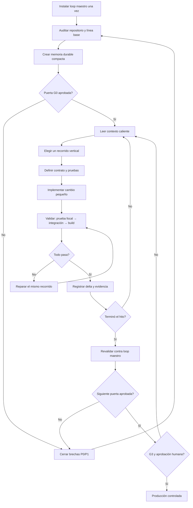
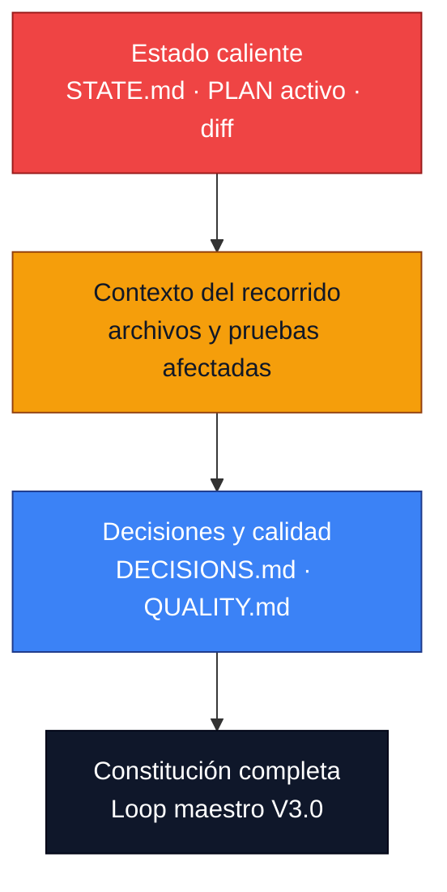
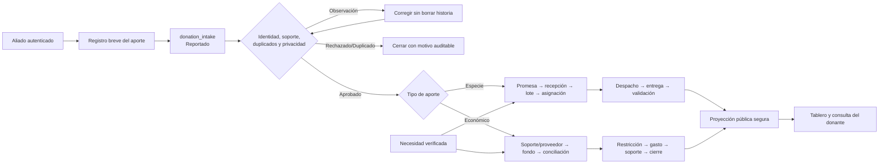

# Sistema operativo compacto para Codex · GPT-5.6 Sol

> **Proyecto:** plataforma de trazabilidad de donaciones en Colombia  
> **Versión:** 1.0 · 13 de agosto de 2026  
> **Modelo recomendado:** `gpt-5.6-sol`  
> **Objetivo:** ejecutar el alcance del loop maestro con máxima calidad, menor repetición de contexto y ciclos verificables.

## Decisión principal

La mejor técnica no es reenviar el loop maestro completo en cada conversación. Es un sistema de dos capas:

1. **Constitución estable:** el archivo `LOOP_MAESTRO_DESARROLLO_PLATAFORMA_DONACIONES_EMERGENCIA.md` conserva alcance, dominio, riesgos, hitos, pruebas y límites. Se instala y procesa una sola vez; se relee completo únicamente al iniciar, cambiar de hito o resolver una contradicción.
2. **Loop operativo compacto:** Codex consulta memoria breve dentro del repositorio, implementa un único recorrido vertical, verifica, repara y registra solamente el cambio de estado.

Esto mantiene la especificación completa sin pagar su costo de lectura y repetición en cada ciclo.

## Diagrama del sistema



## Pirámide de contexto



Codex debe comenzar arriba y descender solo cuando la información necesaria no esté disponible. La capacidad máxima de contexto no es una meta de consumo.

## Diagrama del recorrido de producto que guía el desarrollo



Cada incremento debe recorrer verticalmente una parte comprobable de este diagrama. Nunca se publica directamente desde `donation_intake`.

## Estructura mínima de memoria

Crear en el repositorio:

```text
AGENTS.md
docs/
  ai/
    CHARTER.md
    PLAN.md
    STATE.md
    DECISIONS.md
    QUALITY.md
    archive/
```

### `AGENTS.md`

Solo reglas durables para trabajar en el repositorio: comandos, convenciones, rutas protegidas, límites de autorización y definición general de terminado. No repetir la especificación funcional.

### `CHARTER.md`

Resumen estable derivado del loop maestro:

- propósito y no objetivos;
- actores y recorridos críticos;
- reglas innegociables;
- arquitectura acordada;
- puertas G0–G3;
- enlace al loop maestro como fuente normativa.

Objetivo interno: máximo 250 líneas. Cambia poco.

### `PLAN.md`

Solo incluye:

- hito actual;
- recorridos verticales pendientes;
- dependencias;
- criterios de salida;
- validaciones asociadas.

Mantener visible el hito actual y los dos siguientes. Archivar detalle completado.

### `STATE.md`

Es la memoria caliente y debe poder leerse en segundos:

```markdown
# Estado actual
- Puerta/hito:
- Último resultado comprobado:
- Recorrido activo:
- Próxima acción exacta:
- Bloqueos reales:

## Delta último ciclo
- Cambios:
- Pruebas ejecutadas:
- Resultado:
- Evidencia:

## Contexto que debe cargarse
- Archivos:
- Decisiones:
- Riesgos:
```

Objetivo interno: máximo 120 líneas. Reemplazar información vencida; mover historia útil a `archive/`.

### `DECISIONS.md`

Decisiones breves y append-only: fecha, decisión, motivo, alternativas descartadas y consecuencia. No documentar decisiones reversibles triviales.

### `QUALITY.md`

Concentra trazabilidad, riesgos, pruebas E2E, seguridad, privacidad, accesibilidad y puertas. Usar tablas y referencias; no duplicar texto del loop maestro.

## El micro-loop CERRAR

Repetir un ciclo por recorrido vertical:

### C — Cargar el mínimo

1. Leer `AGENTS.md`, `docs/ai/STATE.md` y la sección activa de `PLAN.md`.
2. Revisar el diff y fallos existentes.
3. Buscar con `rg` antes de abrir archivos completos.
4. Cargar solo decisiones, reglas y pruebas relacionadas con el recorrido.

### E — Elegir una sola unidad de valor

Escoger el recorrido incompleto con mayor prioridad según este orden:

1. P0/P1 y riesgo de daño.
2. Privacidad, dinero, identidad e integridad.
3. Bloqueo del siguiente hito.
4. Valor operacional verificable.
5. Accesibilidad, rendimiento y pulido.

Una unidad no es “hacer el backend” ni “crear las pantallas”. Es, por ejemplo: “aliado autenticado registra una donación en especie con dos artículos y obtiene una constancia sin publicación automática”.

### R — Redactar el contrato del ciclo

Antes de editar, definir como máximo:

- resultado observable;
- 3–7 criterios de aceptación;
- transición de estado;
- permisos y datos sensibles;
- prueba negativa principal;
- comandos de validación;
- condición para detenerse.

Si no cabe en un ciclo, dividir por comportamiento, no por capa técnica.

### R — Realizar el cambio

- Implementar frontend, servidor, persistencia, autorización, auditoría y pruebas necesarias para ese recorrido.
- Mantener el diff pequeño, reversible y coherente.
- Reusar reglas canónicas; no duplicarlas entre cliente, API y Excel.
- No abrir otro recorrido mientras el actual esté roto.
- Para tareas independientes y de solo lectura, se puede paralelizar; evitar agentes que editen los mismos archivos.

### A — Asegurar con evidencia

Validar en embudo:

1. prueba focal del cambio;
2. pruebas unitarias/integración relacionadas;
3. autorización, idempotencia, privacidad y transición de estado;
4. lint y typecheck del alcance;
5. build y E2E del hito cuando corresponda;
6. inspección visual/responsive si cambia interfaz;
7. suite completa al cerrar hito o antes de una puerta.

Si falla una validación introducida por el cambio, reparar y repetir. No reducir la prueba para obtener verde.

### R — Registrar solo el delta

Actualizar `STATE.md`, `PLAN.md`, `DECISIONS.md` o `QUALITY.md` solo si cambió su verdad. Guardar:

- qué quedó comprobado;
- comandos y resultado;
- fallo o riesgo pendiente;
- próxima acción exacta;
- archivos que debe leer el siguiente ciclo.

Después volver a **C** sin pedir confirmación para trabajo local, reversible y ya autorizado.

## Enrutamiento de razonamiento para GPT-5.6 Sol

No usar el máximo esfuerzo durante todo el proyecto. Aplicar el esfuerzo donde cambia el resultado:

| Trabajo | Esfuerzo recomendado | Motivo |
|---|---:|---|
| Puerta Cero, arquitectura, modelo de datos, migración, seguridad y finanzas | `xhigh` | Alto impacto y muchas dependencias |
| Implementación normal de un recorrido vertical | `high` | Buen equilibrio entre precisión y costo |
| Cambios mecánicos, documentación y pruebas repetitivas | `medium` | Menor complejidad semántica |
| Red team final o bloqueo difícil con criterios claros | `max` o modo Pro en API | Calidad primero; uso selectivo |

En Codex, si la interfaz presenta nombres como “Alto”, “Extra alto” o “Avanzado”, usar el equivalente disponible. No cambiar de modelo durante el mismo recorrido sin registrar el motivo.

La documentación oficial indica que GPT-5.6 admite `none`, `low`, `medium`, `high`, `xhigh` y `max`; recomienda medir si un nivel menor conserva calidad. El modo Pro es útil para tareas difíciles donde una mejora marginal justifica mayor latencia y consumo, no para trabajo rutinario.

## Protocolo de ahorro de tokens

### Reglas obligatorias

1. El loop maestro se referencia por ruta; no se pega de nuevo.
2. Cada instrucción vive en un solo lugar.
3. `STATE.md` contiene estado actual, no diario histórico completo.
4. Leer primero índice, búsqueda o diff; abrir únicamente rangos relevantes.
5. No releer archivos que no cambiaron si `STATE.md` ya contiene la conclusión válida.
6. Guardar logs extensos como archivos; reportar comando, salida relevante y ruta.
7. Ejecutar pruebas focales durante edición y suites amplias en cierres de hito.
8. Resumir salidas de herramientas sin omitir errores, conteos ni evidencia crítica.
9. Evitar explicaciones genéricas y repetir planes ya registrados.
10. Pedir al usuario solo decisiones que cambien legalidad, dinero, producción, datos o alcance.
11. Mantener prefijo estable y contexto dinámico al final cuando se use API, para aprovechar caché.
12. Si la conversación crece, confiar en los archivos de estado y no en la memoria narrativa del chat.

### Presupuesto operativo interno

No es un límite del modelo; es una disciplina del proyecto:

- contexto caliente por ciclo: idealmente 10.000–30.000 tokens;
- respuesta de avance: máximo 8 líneas, salvo hallazgo crítico;
- informe de cierre: conclusión, evidencia, pendiente y siguiente acción;
- máximo un recorrido activo;
- máximo dos reintentos con la misma táctica antes de reducir el caso o cambiar de enfoque.

GPT-5.6 Sol dispone de una ventana extensa, pero las solicitudes superiores a 272.000 tokens tienen una tarifa mayor. Mantener el contexto por debajo de ese umbral siempre que el trabajo no exija lo contrario.

## Prompt 1 — Instalación única

Ejecutar una vez, preferiblemente con `gpt-5.6-sol` en `xhigh`:

```text
Trabaja como líder de producto e ingeniería de esta plataforma de trazabilidad de donaciones.

FUENTE NORMATIVA
Lee por completo `LOOP_MAESTRO_DESARROLLO_PLATAFORMA_DONACIONES_EMERGENCIA.md`. No lo resumas en el chat ni dupliques su contenido. Trátalo como constitución del proyecto.

OBJETIVO DE ESTA EJECUCIÓN
1. Lee AGENTS.md e inspecciona repositorio, stack, diff, migraciones, pruebas y configuración.
2. Ejecuta una línea base no destructiva: instalación disponible, lint, typecheck, pruebas, build y arranque aplicables.
3. Crea o normaliza `docs/ai/CHARTER.md`, `PLAN.md`, `STATE.md`, `DECISIONS.md`, `QUALITY.md` y `archive/`.
4. Ejecuta Puerta Cero del loop maestro. Registra brechas P0–P3, responsables, prueba de cierre y bloqueos humanos.
5. Corrige documentación, arquitectura o vulnerabilidades P0 evidentes. No construyas módulos nuevos hasta que P0/P1 de especificación sean cero.
6. Define el primer recorrido vertical seguro, sus 3–7 criterios y comandos de validación.

AUTONOMÍA
Puedes leer, editar dentro del repositorio y ejecutar validaciones locales reversibles. No despliegues, publiques, migres datos vivos, recaudes, envíes mensajes ni hagas cambios externos/destructivos sin autorización.

EFICIENCIA
Usa búsqueda antes de lectura completa. No repitas la especificación. Guarda estado durable y responde solo con: resultado, evidencia, brechas, puerta alcanzada y siguiente recorrido.

SALIDA
Deja el repositorio reanudable aunque la ejecución se interrumpa. Termina cuando G0 quede aprobado o exista un bloqueo humano real con todo el trabajo independiente agotado.
```

## Prompt 2 — Reanudación diaria ultracompacta

Este es el prompt que debe usarse la mayoría de las veces:

```text
Continúa el proyecto aplicando el micro-loop CERRAR.

Lee `AGENTS.md`, `docs/ai/STATE.md`, la sección activa de `docs/ai/PLAN.md` y solo los archivos allí referenciados. Consulta el loop maestro completo únicamente si cambió el hito, existe una contradicción o STATE lo exige.

Verifica el estado real y ejecuta un solo recorrido vertical: define 3–7 criterios, implementa extremo a extremo, prueba en embudo, repara fallos y registra únicamente el delta. No repitas trabajo aprobado ni abras otro recorrido con una regresión P0/P1. Continúa sin pedir permiso para cambios locales reversibles; detente ante una decisión humana material.

Al cerrar, informa: resultado, evidencia, pendiente y próxima acción. Mantén `STATE.md` por debajo de 120 líneas.
```

## Prompt 3 — Cierre de hito o auditoría fuerte

Usar en `xhigh` o, si se trabaja mediante API y el costo se justifica, modo Pro:

```text
Audita el hito actual contra el loop maestro y `docs/ai/QUALITY.md`.

No implementes funciones nuevas. Reproduce los recorridos E2E aplicables y busca: contradicciones, permisos rotos, exposición de datos, fraude, duplicados, concurrencia, reversos, pérdida de evidencia, métricas no conciliadas, fallos offline, accesibilidad y recuperación.

Para cada brecha entrega severidad, evidencia reproducible, impacto, corrección mínima y prueba de cierre. Repara automáticamente cambios locales dentro del alcance y repite la validación. Actualiza la puerta solo con evidencia. Si P0/P1 no llega a cero, no avances de hito.
```

## Prompt 4 — Rescate cuando el agente entra en un loop improductivo

```text
Detén la táctica actual. No repitas el mismo comando o cambio.

Lee el último fallo y el diff. Reduce el problema al caso mínimo reproducible, separa fallo preexistente de regresión, formula hasta tres hipótesis ordenadas y ejecuta la comprobación más barata que pueda descartarlas. Si el bloqueo es externo, aísla el adaptador y continúa solo trabajo independiente. Registra evidencia y la próxima acción en STATE.md.
```

## Formato obligatorio de cierre de cada ciclo

```markdown
Resultado: [implementado y probado | parcial | bloqueado]
Evidencia: [comandos/pruebas y resultado]
Cambios: [máximo 5 puntos]
Pendiente: [riesgo o criterio no cerrado]
Siguiente: [una acción exacta]
```

No imprimir nuevamente el plan completo, el árbol de archivos o logs exitosos extensos.

## Uso en Codex frente a GPT/API

### Codex — recomendado para construir

- Trabaja directamente sobre el repositorio y deja allí la memoria durable.
- Usa Plan mode al iniciar o cambiar de hito.
- Conserva diffs pequeños y validaciones ejecutables.
- Usa paralelismo solo en análisis independientes; integra en un único hilo responsable.
- Reanuda con el Prompt 2.

### GPT-5.6 Sol mediante Responses API

- Usa `gpt-5.6-sol` y configura `reasoning.effort` por tipo de tarea.
- Mantén metas, restricciones y formato estables en el prefijo; agrega estado dinámico al final.
- Para un trabajo estable entre turnos, conserva el estado de conversación o usa `previous_response_id` y razonamiento persistido según la configuración de la aplicación.
- Usa llamadas programáticas únicamente en etapas acotadas de filtrado, unión, deduplicación o validación; conserva juicio semántico y aprobaciones en llamadas directas.
- Evalúa éxito, completitud, evidencia, tokens, latencia y costo; menos llamadas no sirven si baja la calidad.

## Matriz de control de calidad y costo

Comparar el loop maestro reenviado frente al sistema compacto en tres tareas reales:

| Prueba | Debe medir |
|---|---|
| Ingreso de aliado con especie | E2E aprobado, privacidad, idempotencia y tokens |
| Conciliación de aporte económico | Exactitud, reversos, segregación, tokens y tiempo |
| Migración de Excel legado | Conteos, cuarentena, rollback, llamadas y costo |

Aceptar la optimización únicamente si:

- pasan los mismos criterios críticos;
- P0/P1 no aumenta;
- el agente no pierde decisiones previas;
- baja el contexto repetido o el costo total;
- el tiempo hasta evidencia funcional mejora.

## Antipatrones prohibidos

- Pegar las 949 líneas del loop en cada mensaje.
- Pedir “haz todo” sin estado, siguiente acción ni criterios.
- Crear frontend, backend y base por separado sin un recorrido E2E.
- Usar `max` o Pro de forma permanente.
- Abrir todos los archivos “por si acaso”.
- Mantener planes y reportes históricos completos en el contexto caliente.
- Dar por terminado porque compila o se ve bien.
- Paralelizar ediciones sobre los mismos archivos.
- Repetir una prueba fallida sin cambiar hipótesis o táctica.
- Convertir datos declarados por aliados en cifras públicas verificadas.

## Definición de éxito

El sistema operativo está bien instalado cuando otra sesión de Codex puede entrar al repositorio, leer menos de cinco archivos breves, identificar el estado comprobado, ejecutar el siguiente recorrido sin reconstruir la historia y demostrar su resultado mediante pruebas. La calidad sigue gobernada por el loop maestro; el micro-loop solo reduce repetición, deriva y tiempo de coordinación.

## Fuentes oficiales de OpenAI

- [GPT-5.6 Sol — modelo, contexto, esfuerzos y precios](https://developers.openai.com/api/docs/models/gpt-5.6-sol)
- [Guía oficial de GPT-5.6 — prompting, razonamiento, caché y herramientas](https://developers.openai.com/api/docs/guides/prompt-guidance-gpt-5p6)
- [OpenAI — Run long-horizon tasks with Codex](https://developers.openai.com/blog/run-long-horizon-tasks-with-codex)
